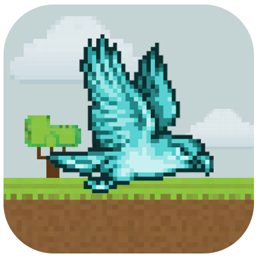

<h1 align="center">
    
</h1>

<h4 align="center">
  # 🐦 game-flappy-pombo
</h4>

## 💻 Projeto
Game desenvolvido na enginne [Godot](https://godotengine.org/) 
você pode conferir o game 👉 [Quero jogar](https://rafaelvsc.github.io/game-flappy-pombo/)

Feito com horas em frente ao 👨‍💻 por [Rafael Vescio](https://www.linkedin.com/in/rafael-vescio/)